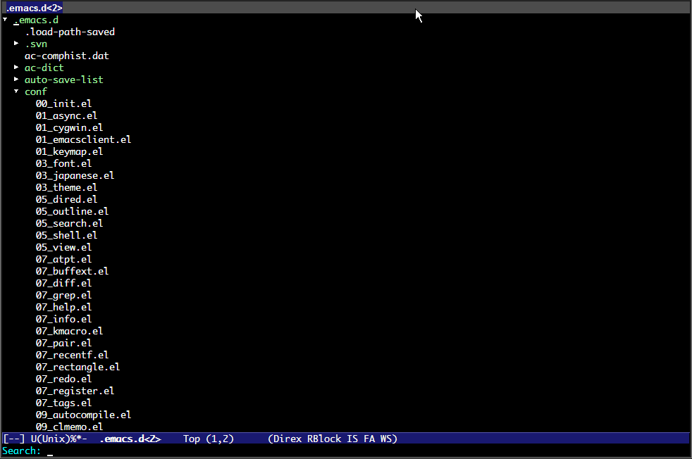

# What's this?

This is a extension of Emacs that provides incremental search like anything.el/helm.el
to the node of .

# Demo



# Feature

-   Grep like anything.el/helm.el
-   Grep using migemo.el

# Install

### If use package.el

2014/04/11 It's available by using melpa.

### If use el-get.el

2014/04/11 It's available. But, master branch only.

### If use auto-install.el

```lisp
(auto-install-from-url "https://raw.github.com/aki2o/direx-grep/master/direx-grep.el")
```
-   In this case, you need to install each of the following dependency.

### Manually

Download direx-grep.el and put it on your load-path.  
-   In this case, you need to install each of the following dependency.

### Dependency

-   

# Configuration

```lisp
(require 'direx-grep)
(define-key direx:direx-mode-map (kbd "s") 'direx-grep:grep-item)
(define-key direx:direx-mode-map (kbd "a") 'direx-grep:show-all-item-at-point)
(define-key direx:direx-mode-map (kbd "A") 'direx-grep:show-all-item)
```

# Usage

### Start grep

Push `direx-grep:grep-item` key in direx.el buffer.  
The target is the shown node under the pointed node.  
If you want to search all node, which includes the hidden node,
M-x `direx:expand-item-recursively` before grep.  

### Toggle to use migemo.el

Push `direx-grep:toggle-use-migemo-key` in mini-buffer.  
`direx-grep:use-migemo` detects whether to use migemo.el at the start of `direx-grep:grep-item`.  

### Turn back from grep

The state of grep don't turn back automatically.  
For that, push `direx-grep:show-all-item-at-point` / `direx-grep:show-all-item` key in direx.el buffer.  

# Tested On

-   Emacs &#x2026; GNU Emacs 24.3.1 (i686-pc-linux-gnu, GTK+ Version 3.4.2) of 2014-02-22 on chindi10, modified by Debian
-   direx.el &#x2026; 0.1alpha

**Enjoy!!!**
